# 这里展示的是总体的一些内容和测试部分，本项目的精华部分尤其是抽象图的建立详见博客1，3

### 根据大概实际用时 填补最开始的表格（记录到第三次迭代）
| PSP                                     | Personal Software Process Stages        | 预估耗时（分钟） | 实际耗时（分钟） |
| --------------------------------------- | --------------------------------------- | ---------------- | ---------------- |
| Planning                                | 计划                                    |                  |                  |
| · Estimate                              | · 估计这个任务需要多少时间              |        30         |        20         |
| Development                             | 开发                                    |                  |                  |
| · Analysis                              | · 需求分析 (包括学习新技术)             | 120 | 200          |
| · Design Spec                           | · 生成设计文档                          | 200 |200               |
| · Design Review                         | · 设计复审 (和同事审核设计文档)         | 60 |  100               |
| · Coding Standard                       | · 代码规范 (为目前的开发制定合适的规范) | 180 | 120             |
| · Design                                | · 具体设计                              | 210 |400              |
| · Coding                                | · 具体编码                              | 600 |1000             |
| · Code Review                           | · 代码复审                              | 180 | 100 |
| · Test                                  | · 测试（自我测试，修改代码，提交修改）  | 300 | 300             |
| Reporting                               | 报告                                    |                  |                  |
| · Test Report                           | · 测试报告                              | 600 | 600 |
| · Size Measurement                      | · 计算工作量                            | 100 | 80 |
| · Postmortem & Process Improvement Plan | · 事后总结, 并提出过程改进计划          | 90 | 150 |
|                                         | 合计                                    | 2800 | 3270 |

### 项目亮点：
项目两点分为三个介绍：

#### 后端部分
采用分层图+时刻表配置文件，完美模拟了现实地铁线路中所面临的几乎所有情况。
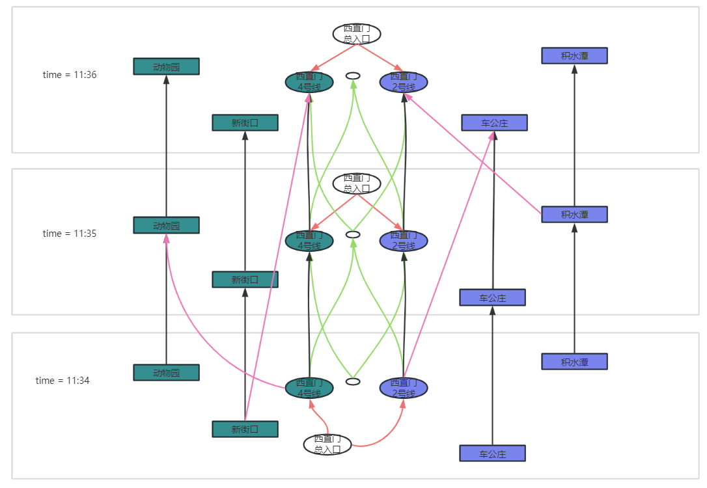

这样的建图有着极强的扩展能力和极高的运行效率，具体说明详见测试文档。

#### 前端部分
前端采用QT进行开发，开发环境：Qt 4.11.2

消除了所有警告：
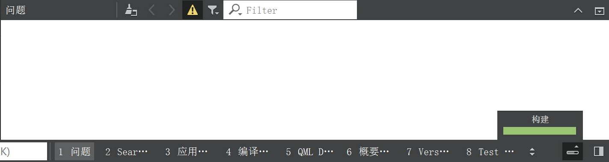

发布release版本，使用Qt 5.12.8 MinGW 7.3.0 32-bit

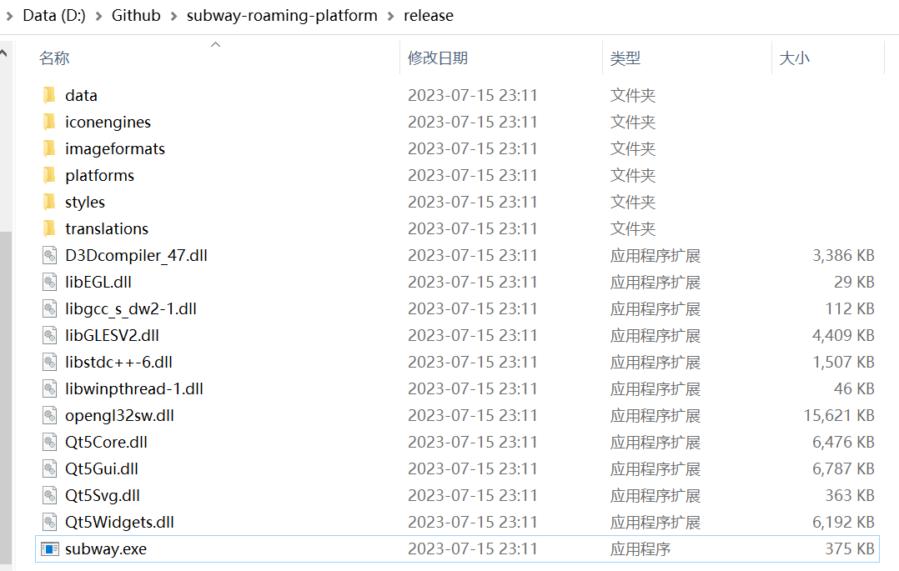

生成了.exe文件放在项目根目录release文件夹内。可以将release单独移出到任何位置使用，但是**必须**使用**英文路径名**。

下图展示了最终release版本的主要界面。**更具体的讲解录制了视频放于项目根目录**。

主页面如下，可以用过左上角import根据config导入不同的地图。在release/data文件夹内预置了两份不同的config文件供使用。如果想要生成其他时刻表可以根据week3中的描述利用generator.py生成。

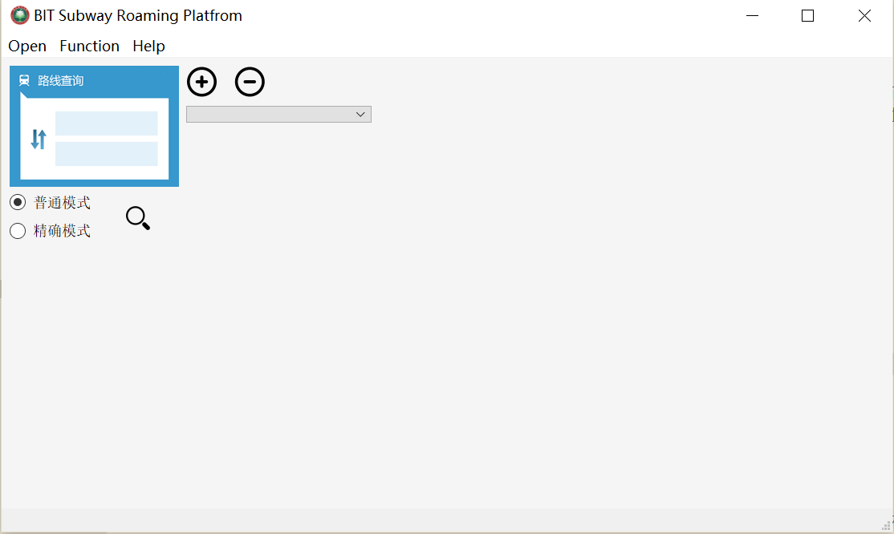

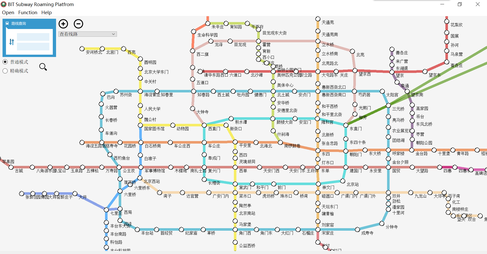

地铁线路查询效果：

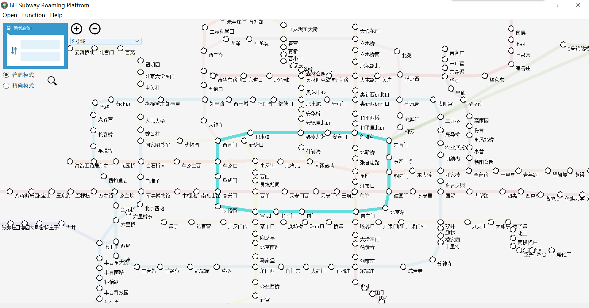

不考虑时刻表查询两点间的耗时：

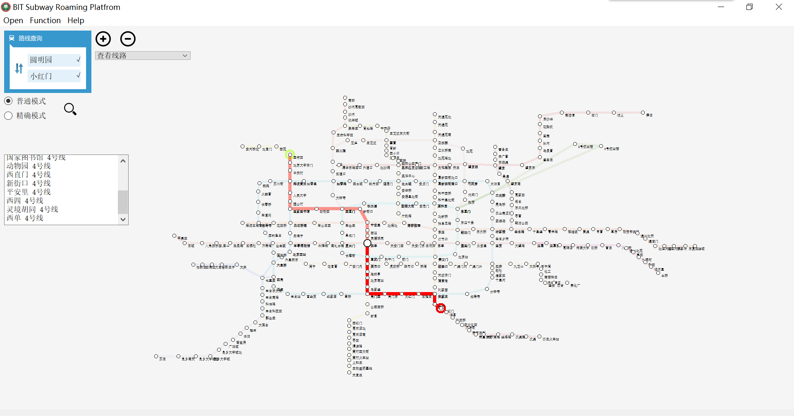

考虑时刻表查询两点间的耗时（注意左边文本框中时间相关的输出）：

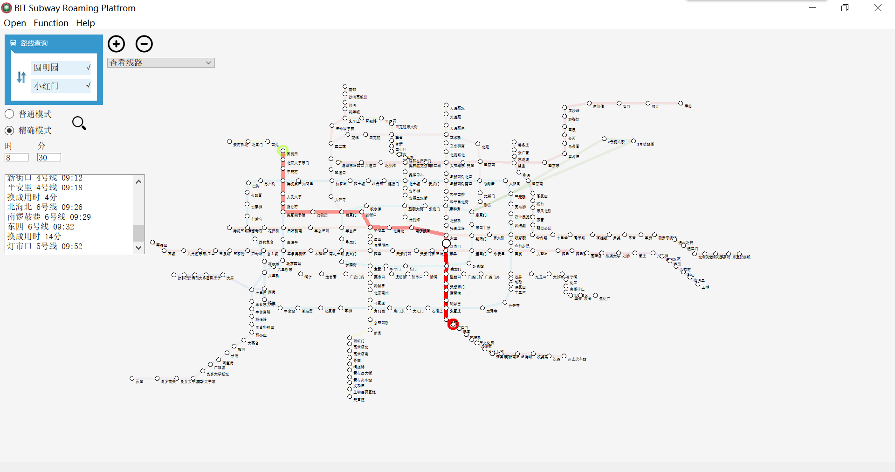

#### 前后端接口
本次项目使用了前后端分离的结构，这样一个结构有助于我们对代码的调试以及后续彻底对前后端的分离（比如借助网络协议实现真正的应用开发）

### 项目规范性说明

#### 信息隐藏设计 Information Hiding
在本次代码设计中，使用了C++面向程序设计。所有的均使用类包装，对主要承载信息的类采用私有变量进行private保护。

对车站Node和列车Line两个基本类统一继承自SubwayStruct，减少了代码中对Node，Line具体的调用。

#### 接口设计 Interface Design
由于前后端分别两个人开发，因此接口设计主要说明前后端接口设计。

前后端的通讯暂时采用了内存通讯，没有提升到更高层次，但是为了为适应网络层传输，这里的内存通讯也只是传输了装有string的vector，如果要将前后端彻底分离，实现基于网络的前后端应用，只要设计一个简单的协议，比如以#作为分隔符，就可以实现从vector<string>到string的转换，实现更高级的通讯。

前后端目前的结构是前端采集用户的输入，传入三个参数分别是：起点站，终点站和出发时间(共两个模式，其中一个模式考虑时间因素，对应迭代需求3)。

#### 松散耦合 Loose Coupling
耦合主要分为后端类之间的耦合和前后端之间的耦合

后端类主要是Node，Line两个信息类和Graph，AbstGraph，Config三个任务承载类之间的耦合。Config与Graph之间采用控制耦合，给予Graph建图时所需要的配置信息。AbstGraph和Config在没有直接联系，AbstGraph通过Graph指导建立抽象的图，用以在上面建立复杂的图结构后跑(0/1)BFS。AbstGraph和Graph之间采用数据耦合为主，特征耦合为辅，少许控制耦合的耦合结构。Graph主要执行数据文件的翻译工作，以及处理AbstGraph返回的抽象结果。

前后端接口采用数据耦合和特征耦合，由于前后端都是基于C++的代码，可以直接进行内存结构化传递参数，因此主要通过装有string的vector携带数据，传输后端运算的结果，交由前端进行展示。

#### 描述重要模块接口的设计与实现过程
这一部分详见每周博客。

关键函数流程图：

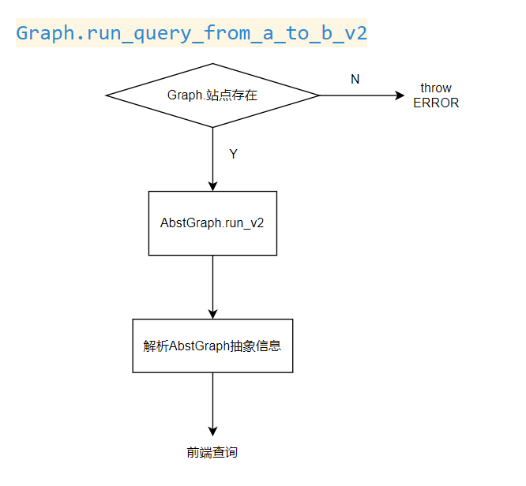

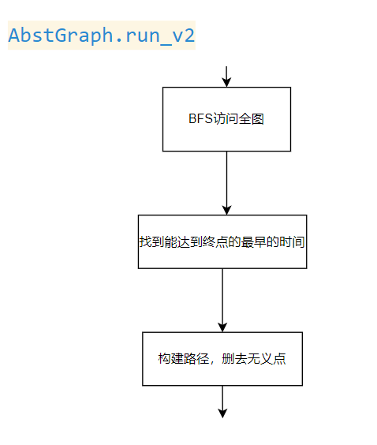

能成功从复杂的抽象图中解析出地铁线路并展示依靠的是三次的路径构建：

第一次是在AbstGraph中，也就是上图中“**构建路径，删去无义点**”的过程。我们在bfs过程中记录了每个点在bfs中的前驱点。这样我们从终点就能倒着推出最优路径上的所有点。这个路径上会有很多辅助点，也就是因为我们建图而造成的辅助点，又或者是分层图的多层点，因此我们在抽象图层得到的路径中要删去这些点。

第二次是在Graph中，也就是上图中“**解析AbstGraph抽象信息**”的过程，我们在AbstGraph返回的点是只有编号的点。因此我们需要根据编号在Graph类中找到相关存储实例，获得编号对应的地铁站，地铁线路名，并且从用分钟表示的时间中解析出h:m格式的时间。而由于在第三次需求中，我们要求需要考虑时间因素，因此会出现在一个站等待而造成反复输出同一个站点，因此在这一部分对这一情况进行了处理，裁剪了相同站点连续重复的问题。

第三次是在前端，对后端发送来的装有string的vector进行最后一次检查。由于在我们的建图中，原地等待动车和多坐一站在坐回来是无法区分的，因此这一问题放在了前端进行处理。

#### UML 与数据流图
用例图
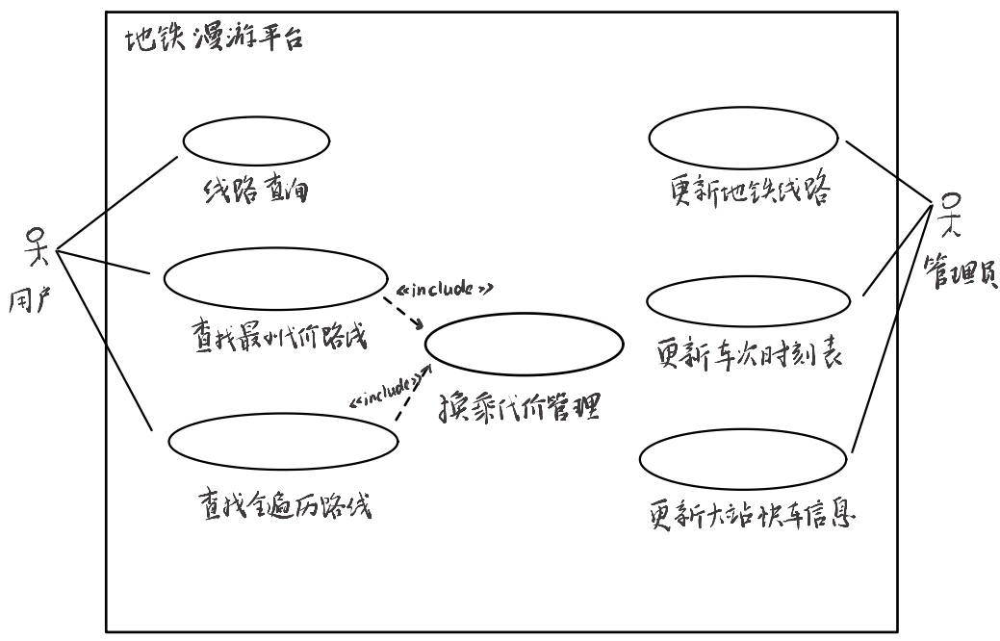

顶层数据流图
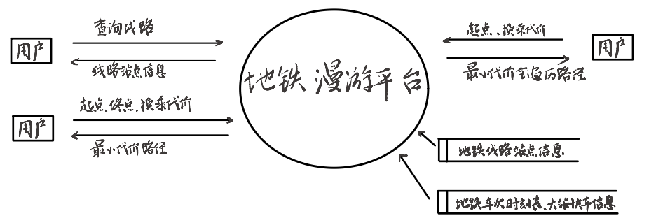

1层数据流图
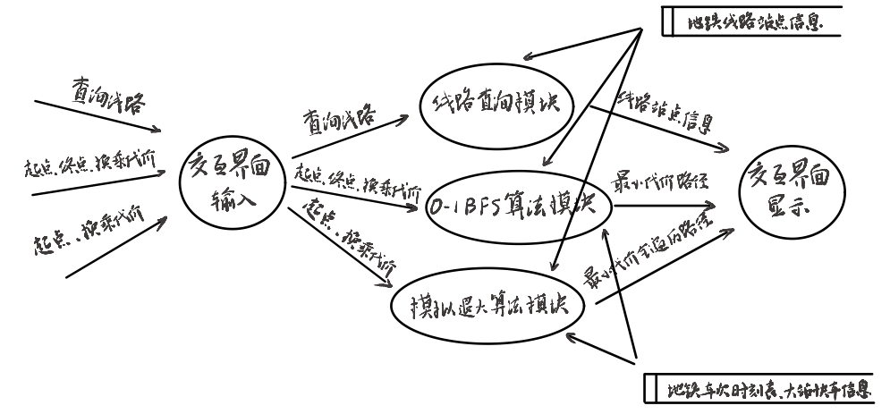

#### 契约式设计 Design by Contract, Code Contract
契约式设计我觉得一个很大的优点就是减少了大量重复的参数检查，减少了编码复杂度。当然也会带来一些弊端，比如当代码有一些隐藏bug的时候，或者受到攻击的时候，往往冗余的检查反而会意想不到的规避这些错误。但是如果采用契约式设计就会产生一些问题。

这我们的项目中，契约式设计主要涉及前后端接口调用时候的问题。一个很明显的问题就是，后端函数接收的站点名是接受过前端检查确实存在的。
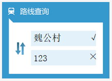
当然，为了防止攻击，后端也对传入的参数进行了进一步检查，对非法的情况将抛出带有提示信息的异常。

还有就是在Graph和AbstGraph之间的调用也体现的契约式设计。比如在AbstGraph中的run_v2函数，我们就在调用它的函数那边保证了传入的点编号一定是合法的。因为这都是在后端的代码，就不需要在AbstGraph这种抽象的类里再进行大量的具体的不必要的重复检查。

#### 程序的代码规范
该项目最重要的代码规范就是一切代码均放置在类里。类内不同函数执行不同的功能，不要杂糅多个功能在同一个函数里。在后端代码中，除了模拟退火函数由于封装了一个类在函数里面较长，其余函数代码几乎都在70行以内。
程序在后端对异常的处理均使用try-catch字段环绕。使用throw语句对可预见的异常进行抛出，使用catch语句接收并且在控制台输出进行提示。

#### 界面模块的详细设计过程
界面模块主要完成的功能是接收用户信输入、传递给后端功能模块、接收后端运算结果并向用户展现反馈结果。
基于黄金三原则的思想，结合地铁信息查询平台的功能要求，界面主要设置了以下几个组件。

路线起始点信息：线路查询的起点和终点的信息在两个文本行中显示。用户可以通过两种方式输入起点和终点信息，一种是直接在文本框中输入站点名称，程序会实时判断站点名称是否有效并给出提示。对于合法的站点名称，程序会自动将对应站点在地图上的位置高亮以表示设置成功。另一种是直接在地图上选择站点，点击对应的站点，程序会自动将第一次点击的站点名称填入起点位置，第二次点击的站点名称填入终点位置。

线路查询：本项目可以通过下拉框来选择需要查询的地铁线路，选中后会自动刷新线路图，被选中的线路会高亮显示，其他线路则会变淡（透明度增加）。

查询模式选择：本项目设计了两种不同的模式。一种是普通模式，即参考现在北京地铁的线路情况，基于需求2完成的路线查询功能。一种是精确模式，即不同时刻的发车信息，考虑了大站快车的情况，基于需求3完成的路线查询功能。在普通模式种，只需要确定好起点和终点的位置即可进行路径查询，系统会显示最小代价的路径，包括动态演示以及线路和站点信息。在精确模式中，用户确定起点和终点的位置后，还会触发在普通模式种隐藏的输入框，输入当前的时间信息。系统会基于特点的时刻以及大站快车的情况规划最小代价的路线。在普通模式的基础上，精确模式还会进一步显示到达各个站点的具体时间和换乘等待时间。

路线的动态展示：本项目利用丰富的动态信息来展示规划的路径。当后台运算完毕后，交互界面会首先高亮显示规划路径，再以0.5s为间隔动态展示经过的站点。对于已经经过的路线部分，路线会成浅色。同时，界面会在交互框中依次详细显示动态过程中经过的站点、线路和时间等信息。为了实现动态功能，程序利用了多线程的方式来完成线路的定时重画。

地图拖动功能：本项目可以自动检测鼠标的拖动情况，如果检测到鼠标带着地图移动，则会自动刷新界面的地图，使得地图始终跟随鼠标移动。

地图放大与缩小：本项目可以通过点击对应按钮或者鼠标滚轮的方式实现地图和站点名称的同步放大和缩小。

#### 界面模块与其它模块的对接
界面模块主要两个位置与后端模块进行调用。在普通模式中，会调用后端在需求2中实现的路径规划函数。在精确模式中，会调用后端在需求3中实现的路径规划函数。由设计思路和开发博客可知，本项目的界面/控制/数据模块体现了MVC的设计模式。

#### 描述结对的过程
我们是在大一开始就有在一些课程作业上合作，所以听说本次作业也有阶段项目就进行了组队，整体流程顺利。

#### 合作
在软件工程项目开发中，结对编程是一种卓有成效的合作方式。它以两位开发者共同协作的形式进行，旨在解决问题、设计和编写代码。

优点：

1. 它促进了**知识的共享**和学习。通过实时交流，开发者能够分享各自的知识和经验，从而加速学习过程并提高技能水平。

2. 结对编程有助于提高**代码质量**。通过持续的代码审查和纠正，可以及早发现和纠正潜在缺陷和错误，从而提高代码的可靠性和健壮性。

3. 结对编程能够减少**调试时间**。由于两位开发者共同参与编写和审查代码，问题可以在早期阶段被发现和解决，从而减少了调试的工作量和时间成本。

4. 结对编程还有助于改进**设计和架构**。合作伙伴之间的互动和讨论促使设计决策更加审慎和全面，从而产生更优秀的软件架构和设计方案。

5. 结对编程提升了团队合作和协作能力。通过共同努力和交流，开发者之间建立起更紧密的合作关系，加强了团队的凝聚力和效率。

缺点：

1. 结对编程也存在一些挑战。它需要额外的资源和时间，以及双方之间的良好沟通和协调。

2. 个人工作风格和习惯，工作的作息的差异可能也需要一定的调和和适应。

综上所述，结对编程在软件工程项目开发中具有显著的优点。它能够提高代码质量、减少调试时间、改进设计和架构，同时增强团队的合作能力。然而，为了充分利用结对编程的优势，需要克服一些挑战，并确保团队的协作和沟通处于良好状态。

朱子林：有较好的图论知识基础，有较丰富的代码编写经验，但是规范不是很好。
罗家安：有较丰富的Qt框架搭建经验，有较良好的代码规范，但是算法设计经验还不够丰富。

改进：由于我们奔着共同的目标——更好的完成本次项目。因此我们更多的是在肯定对方的贡献下大胆的指出对方的不足，这样有助于我们顺利的交流，完成本次工作。

