###  摘要

为了实现地铁线路的建图，我们将地铁数据文件保存在subway_info.txt文件中，程序启动时从该文件读取数据。对于换乘点，考虑到换乘点会产生换乘代价的特殊性，我们采用了**拆点建图**的方式。建图完成后，可以根据用户需求查询线路站点。

为了实现两站点之间最有效线路的计算，我们基于拆分换乘点后的线路图，利用基于双端队列的**01BFS算法**实现了考虑换乘代价的最短路径计算，算法的时间复杂度为$O(n)$。

为了实现所有站点的全遍历回路最短路径的计算，我们利用了**智能优化方法**来实现这个**NP难**问题的近似求解。我们利用**模拟退火算法**，设计合理的全遍历路径规划策略和邻域函数，实现了在有限时间内可行的近似最优路径计算。同时，我们也根据参考资料提出了一种**全自动欧拉图**的近似解法。结果表明，我们利用模拟退火方法求得的最优路径代价优于利用欧拉图等算法求得的结果。

我们证明了从不同站点全遍历的最短路径经过的回路总代价之间的差距不会大于一次换乘代价。因此，针对同一个地铁路线图，我们只需要**离线**计算一次回路后保存下来，待程序上线后直接读取保存的回路信息即可。针对地铁路线可能发生的修改，我们在程序运行时采用了**SHA236算法**进行检查，若发现路线更改，则重新计算全遍历回路最短路径并保存。


### 后端框架设计

主要由subway.cpp和subway_map.cpp承担。

subway.cpp是程序的总入口，负责解析命令行参数以及和用户的交互功能。

subway.cpp通过调用config.cpp，获得配置文件类Config，其中配置文件用.txt格式文件存放于工作目录下。

subway_map.cpp通过两段来维护地铁图，第一段是在构造函数里，根据配置文件中的路径读取以文本格式存储的地铁站和地铁线路表，维护其编号和名字关系。第二段在build函数里，利用邻接表构建地铁图，对于换乘的情况，要对地铁换乘站做**拆点**操作（下分析）。

由于有一个查询某一点出发访问全部点的问题，可以证明若存在某个点出发访问所有点的最短路径（回路），则每一个点出发通过这条路径遍历所有点都是最短的（下证）。因此，在地铁线路不发生改变的前提下，对于所有可能的出发点只要找到**一条**这样的路径即可。由于这个问题难以找到多项式时间解法，我们采用了**近似算法**。为了加快程序对用户的响应时间，我们采用了缓存机制：在第一次计算完近似最优路径后，将这条路径**缓存**于工作目录中，当下一次再询问的时候，我们直接加载这条路径反馈给用户即可。我们通过**SHA236**来验证两次之间地图是否发生了改变，若地图发生了改变，我们则重新对其进行计算。

#### 换乘点拆点建图

对于普通车站之间，我们直接使用一条权值为1的边连接即可。当遇到换乘车站的时候，因为需要考虑换乘的代价，因此我们要设计一种图结构使得在换乘站进行换乘要付出额外的费用。我们这里把每一个换乘站点拆分成$k$个点（$k$ 是换乘站点可换乘的地铁数）。

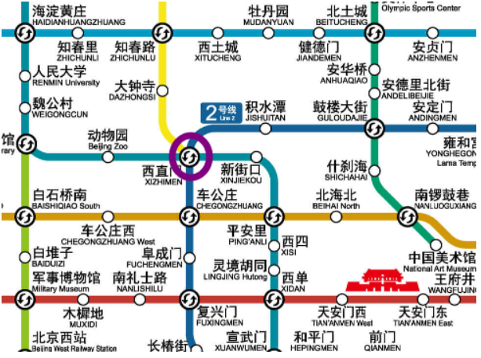

以西直门站为例，下图展示了该站拆点后的图结构：

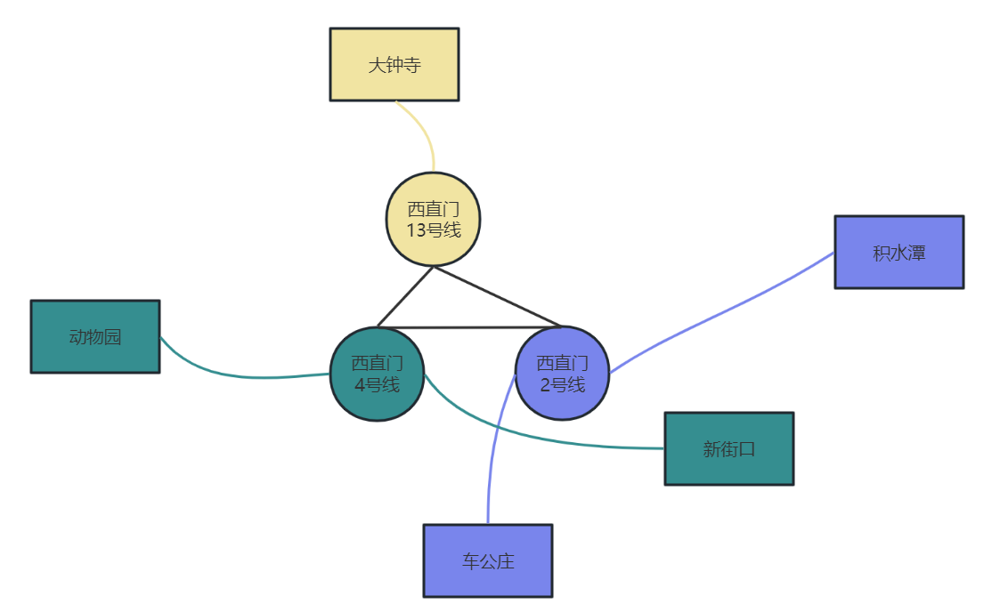

中间三条黑线的边权为**换乘代价（如3）**，而其他边权为1，这样就完成了带有换乘代价的地铁图构建。而如果不需要考虑换乘代价，将黑边权置为0即可。

而这样建出来的图有$1$和$x$两种不同的权值，若要求两点之间的最短路需要使用如Dijkstra等算法，造成$O(n\log n)$以上的复杂度。为了进一步优化运行效率，我们对建图进行进一步的优化，如下图所示：

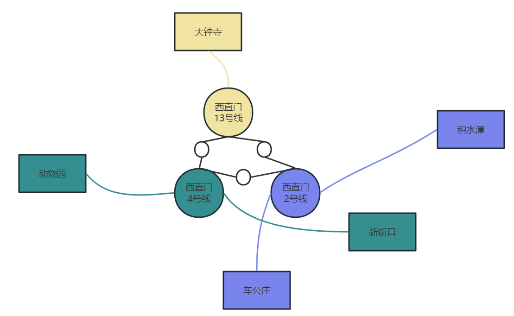

将之前的边拆成多个点，将边权为$x$的边拆成$x-1$个点。点之间连接权值为$1$的边，这样所有边权都为$1$，可以使用**BFS**来代替Dijkstra求最短路，此时复杂度仅为$O(n)$。

不过这会带来一个额外的麻烦：当没有换乘费用的时候，此时需要把这几个点缩在一起（不能建立$-1$个额外点），提高了一倍的编码复杂度。

有一种改进策略是，对于没有换成费用时，拆开的点之间连接边权为0的边，这样全局的边权只会有0和1两种，对于这样的图，可以使用**双端队列优化的BFS**来实现$O(n)$复杂度的最短路。

我们可以对该建图进行进一步的优化，以减小其边数：

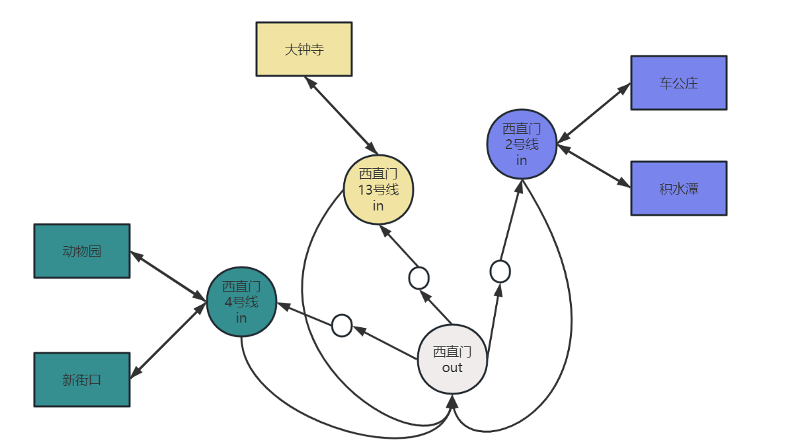

设计每个换乘站的出点和入点，可以用统一的一个出点连接所有入点。对于一个有$n$个地铁经过，换乘费用为$k$的换乘站，这样建图的边数是$n*k$（为了使用$O(n)$算法计算最短路，图中的边权只能为$0$或$1$，上图令out连向in的边权为$1$，in连向out的边权也为1，最大能表达$2+1=3$的换乘费用，总共使用$3*3=9$条边）。

而上一个建图方式的建图边数为$C(n, 2)*K$，当$n$较大时显著大于$n*k$。

然而，北京地铁换乘站以两车换乘站位置，少有$3$车换乘站，找不到$4$车换乘站，因此这一建图方式在这里并无优势。


#### 全遍历路径共享

这一部分证明：若存在某个点出发访问所有点的最短路径，则每一个点出发通过这条路径都是最短的。

由于需要回到起点，因此一条路径可以表示为：$route_1:A \rightarrow X1 \rightarrow X2 \rightarrow ... \rightarrow Xn \rightarrow A$

**a. **假设这就是一条从$A$出发回到$A$的最短路径，那么这条路径一定会经过其他任意一点，如点$B$

则：$route_1:A \rightarrow X1 \rightarrow X2 \rightarrow ... \rightarrow B \rightarrow ... \rightarrow Xn \rightarrow A$

把这条路径从B点的前后断开，得到两条路径：

$route_1^1:A \rightarrow X1 \rightarrow X2 \rightarrow ... \rightarrow B $ 和 $route_1^2:B \rightarrow ... \rightarrow Xn \rightarrow A$

将这两条路径前后顺序交换拼起来就得到了一条由$B$ 出发回到$B$ 的路径 ： $route_1':B \rightarrow ... \rightarrow Xn \rightarrow A \rightarrow X1 \rightarrow X2 \rightarrow ... \rightarrow B $

因此，若$A$有一条最优路径，则其他任意一点沿着这条路径走也能达到和从$A$出发一样的代价。

**b.** 假设从$B$ 出发存在一条比 $route_1'$ 更优的路径：$route_2':B \rightarrow Y1 \rightarrow Y2 \rightarrow ... \rightarrow A \rightarrow ... \rightarrow Yn \rightarrow B$

则同理，有$route_2:A \rightarrow ... \rightarrow Yn \rightarrow B \rightarrow Y1 \rightarrow Y2 \rightarrow ... \rightarrow A $

由于$cost(route_1 = route_1'), cost(route_2 = route_2')$，且$cost(route_2') < cost(route_1')$

则$cost(route_2) < cost(route_1)$，这违背了$route_1$是一条从$A$出发的最短路径这一性质。

因此$route_2'$不存在。

**综上**，由$a. b.$可以知道，存在一条每个点共享的最优路径，且从任意一点出发找到的较优路径对于其他点都是较优的。

但是，以上证明还有一种特殊情况需要考虑。即当中间点$B$为换乘点时，从$A$出发计算的路径包括了在$B$点换乘的代价。然而，如果从$B$点出发，遍历所有点后再回到$B$点时，就不需要再发生换乘了。也就是说，将从$A$点出发计算得到的路径共享到$B$点使用时，会多产生一个换成代价，这就导致可能出现更优的解。但考虑到本题是NP难问题，最优解难以找到，本方法提供了一种误差不多于一次换乘代价的解，我们认为是可以接受的。


#### 全遍历算法实现

本题要求找到从某一个地铁站出发，遍历所有地铁站之后回到这个地铁站的所需要的最短路径。

本题类似于旅行商（TSP）问题。但与旅行商问题不同的是，本题中各个节点可以访问多次，而旅行商问题的每个节点只能访问一次。节点的多次访问增加了问题的复杂度，也导致无法使用传统旅行商算法来求解目标路径。此外，可以证明的是本题也和旅行商问题一样属于NP难问题，并不存在多项式时间的解法，利用状压DP算法可以求出精确解，但时间复杂度为$ O(2^n) $，300余个节点的规模对于这道题目仍然过于庞大。因此，我们考虑采用**智能优化方法**来求解这道题目。

我们采用**模拟退火算法**来逼近这个最短路径。

本题用模拟退火算法的关键在于，**如何找到一种合理的路径构造算法，使得能够定义一种有效的邻域函数**，从而得到一个相邻的解。为此，我们设计了如下的路径构造算法。

输入：起点$start$，地铁所有路线
输出：一条可以实现全遍历的路径

1. 对于所有站点，标记为未访问，$visit(1...n) = true;$
2. 对于起点，标记为已访问，$visit(start) = true;$，设置当前处理站点为 $start$
3. 对于所有还未访问的站点，计算这些站点到当前处理站点的最短路径
4. 为每个还未访问的站点设置权重，站点到当前处理站点的距离越小，权重越大
5. 依据权重选择下一个将要访问的站点$i$，权重越大，被选到的概率越大
6. 沿着当前处理站点到站点i的最短路径进行访问，并将访问沿途经过的站点均标记为已访问
7. 将站点$i$作为当前处理节点，若还有未访问的节点，转到2，否则转到8
8. 添加当前处理节点到起点的最后一条最短路径，即可完成路径构造

模拟退火算法的优化目标：总代价最小

模拟退火算法的邻域函数：选择站点的权重进行微小的随机扰动，得到一个相邻的解

模拟退火算法的接受准则：$Metropolis$准则


此外，参考文件[1]给出了一种**手动**对线路图进行增边和删边后再求欧拉图的解法，这种方法可以求得一个**较优解**。但我们认为手动进行增边和删边不具有普适性，且比较容易出错。因此，我们提出了一种**全自动**的**欧拉图**的方法，不需要手动进行增删边，算法会自动进行效果最优的增删边处理。具体算法如下：

1. 利用**Tarjan算法**求出地铁站图中所有的边双连通分量
2. 找出不是桥（割边）且所连接的两个点均为奇数度的边，删除这些边
3. 对于剩下仍然为奇数度的点，求出两两之间的代价（代价定义为两点之间的路径长度）
4. 这些度为奇数的点和两两之间的边构成一个完全图，接下来使用**带花树算法**求一般图带权最小匹配
5. 连接最小匹配中匹配上的点
6. 利用**Fleury算法**求欧拉回路
7. 在得到的欧拉回路中，将添加的边用真实路径代替，则可求出全遍历的访问路径

然而，这种理论可行的方法工程量过大，开发所需时间过长，我们目前还没有落实到代码实现。但实验结果表明，我们利用模拟退火算法得到的结果已经优于资料上用欧拉图得到的结果。

<center>
    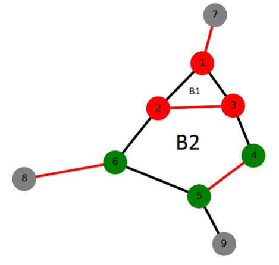
    <div>
      带花树算法实现一般图带权最小匹配
  	</div>
</center>


### 代码实现中的问题与解决方案

#### 起点和重点的选择——分层图

在求解上述最短路的过程中遇到了一个问题：起点不能确定是从被拆开的点中的哪一个点出发，而如果随意选一个，就会有额外的换乘代价。因此需要对建图做出改变。对于终点的选择，只要使用一个映射函数，将表示相同站点的点映射到同一个编号上，检查终点的时候通过这个编号来检查即可。而对于起点，可以采用多次选择不同起点bfs的方案解决，但是这样会造成额外的开销。因此最终选择了采用额外建点构建**分层图**的方式，如下图：

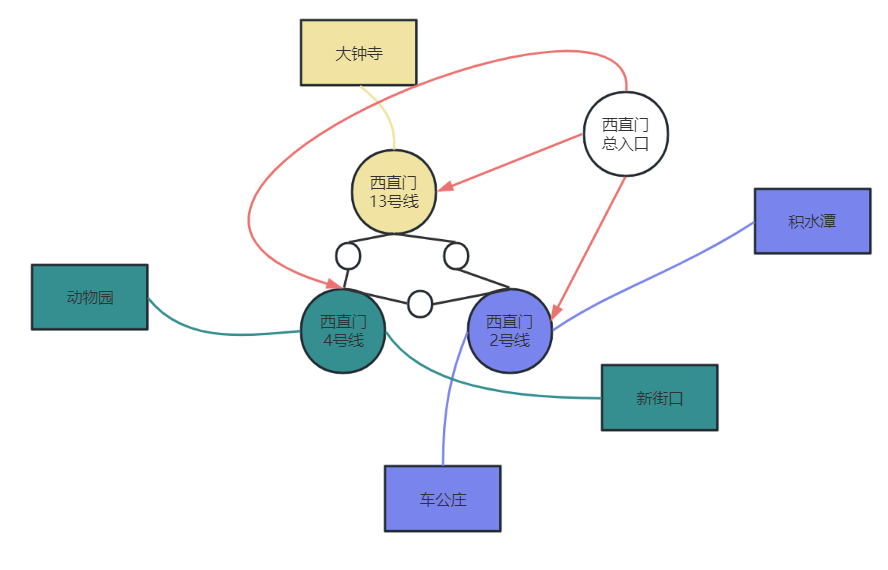

以西直门站为例，构建一个站点总入口，向所有换乘站点连权值为$0$的边，这样当我们选择西直门总入口作为最短路的起点，就能实现同时求出不同起点换乘站到终点的情况。

### 功能测试

#### 线路输出结果测试

* 例如，测试1号线的站点输出结果

  按照题目的输入实例，运行命令依次为 
  
  ```bash
  ./subway.exe
  1号线
  2号线
  ```
  
  程序成功输出了依次序排列的1号线和2号线的所有站点，输出结果如下：
  
  <figure>
  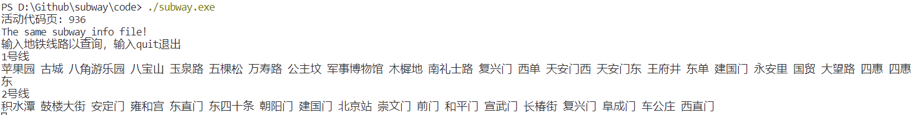 
  </figure>
  
  
* 测试无效输入处理
  
  若查询不存在的100号线，会有无效提醒，输出结果如下：
	
  <figure>
   
  </figure>


#### 两站间最短路径算法正确性测试

* 测试从知春路站到中关村站的最短路径（换成代价为3），程序输出正确：

  <figure>
  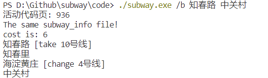 
  </figure>


* 测试从良乡大学城北站到中关村站的最短路径

  按照题目的输入示例，运行命令为 `./subway.exe /b 良乡大学城北 中关村`
  
  程序输出结果如下：
  <figure>
  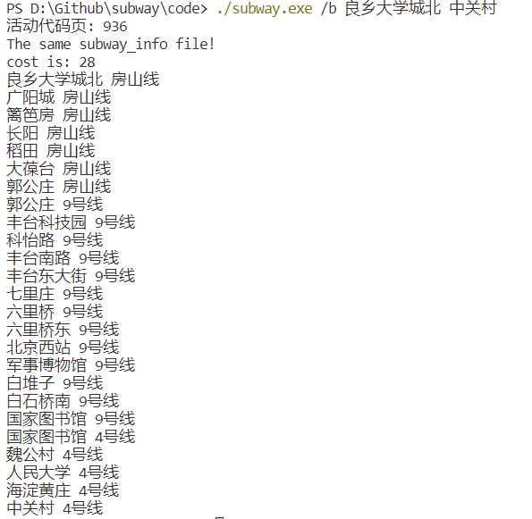 
  </figure>

​	为了验证程序计算出的路径的正确性，我们将这个结果与**百度地图**给出的这两个站点之间路径规划的最优解进行比对，方向我们规划的线路与百度地图规划的线路**完全一致**。

<figure>


</figure>

* 测试从昌平西山口站（最西北的地铁站）到花庄站（最东南的地铁站）的最短路径

	按照题目的输入示例，运行命令为 `./subway.exe /b 昌平西山口 花庄`
	程序输出路径结果如下：      
	<figure>
	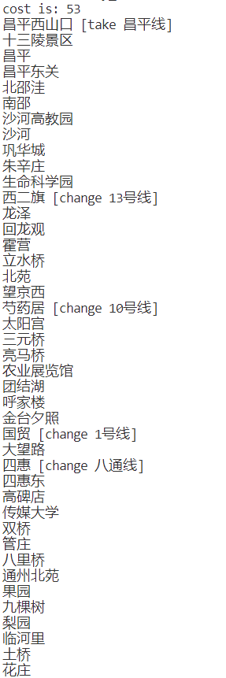 
	</figure>


​	在百度地图中，8号线的终点站从中国美术馆延长到了王府井，和1号线连通了，而题目的地铁线路中王府井和中国美术馆两站并没有连通，这就导致百度地图规划的路径与我们的程序规划的路径不同。不过，从题目给出的地铁线路上看，我们规划的路径具有明显的优越性。

#### 全遍历测试

我们利用模拟退火算法，经过数千万次迭代，最终收敛到稳定的解，用时在10分钟以内。

在换乘代价为0时，我们搜索到的最优解经过的站点数为**543**。

在换乘代价为3时，我们搜索到的最优解经过的站点数为**558**。

  <figure>
  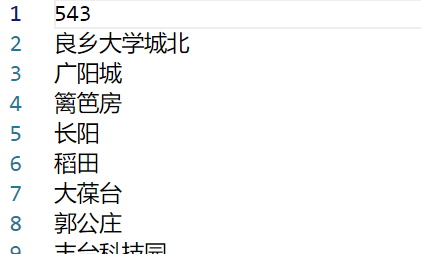 
  
  </figure>


结果表明，我们使用模拟退火算法得到的最小代价**优于目前网络上能够找到的所有包括欧拉图在内的算法得到的最小代价**。

换乘代价为x对应的具体路线规划保存在sub_way_costx.cache文件中。这个文件在离线的时间自动计算生成，程序上线时直接读取使用即可。

需要说明的是，我们的仓库里有两份地铁线路图文件subway_info_old.txt和subway_info.txt。其中线路文件subway_info_old.txt与参考资料使用的线路图一致，用于对比程序性能。在实际使用中，我们采用的是新版的地铁线路文件subway_info.txt。新旧线路图的切换可以在config.txt配置文件中完成。


### 参考资料

[1] [软件工程基础] [结队项目——地铁__FSMM的博客-CSDN博客](https://blog.csdn.net/fsmm_blog/article/details/86306279)

[2] [匈牙利算法与带花树算法] (https://www.luogu.com.cn/blog/potassium/solution-p6699)

