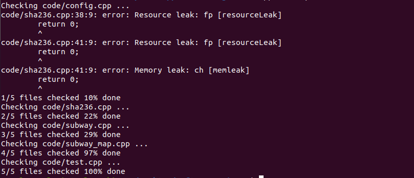
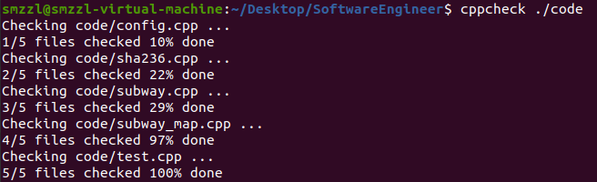
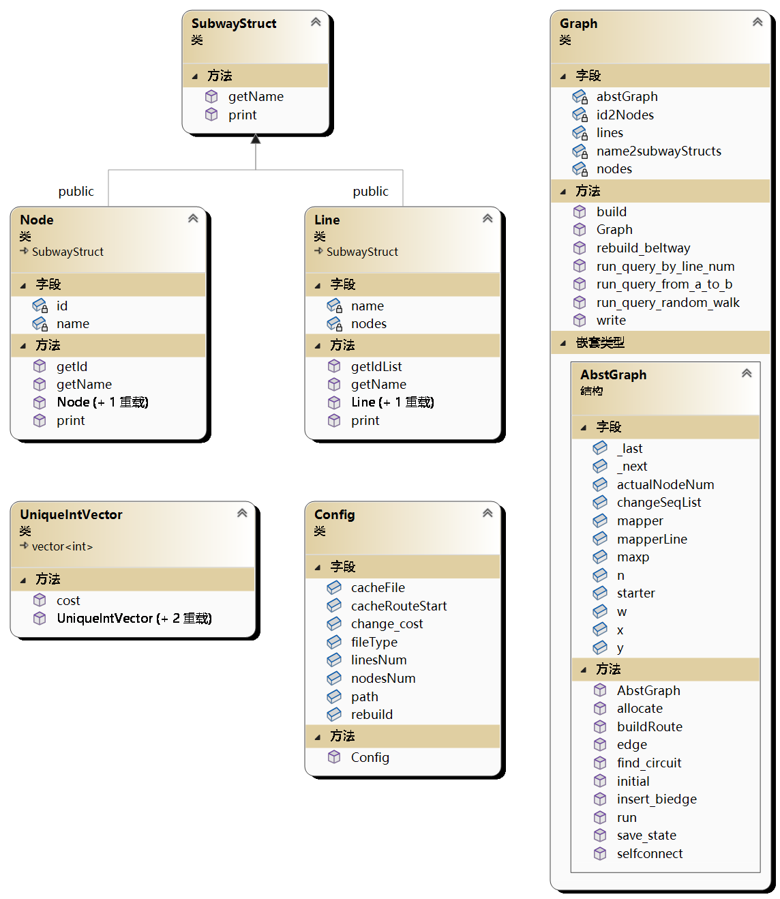

### 第一周代码质量分析及代码结构分析

#### 代码质量分析

验证考试前已提交代码

修改后结果

#### 代码结构分析

程序由subway.cpp中的main函数开始，通过识别命令行参数，执行相应的功能分支。首先会先加载config文件，利用config文件的信息**自动配置**北京地铁线路。
地图线路的构建使用分层结构，北京地铁线路由两层结构构建。分别是**抽象层地图**和**交互层地图**。交互层地图用来和主程序应答用户的需求。当遇到相应访问地铁线路请求的时候，交互层地图**将具体的车站线路名转换为抽象的数字编号**，交给抽象层地图通过最短路，模拟退火等算法解决。
交互层地图和抽象层地图分别是代码中的Graph和AbstGraph类，二者为**复合聚合关系**。由于AbstGraph脱离了Graph就没有自己的意义了，因此在代码中直接将AbstGraph作为了Graph的一个**内部类**。
为了方便存储和修改地铁线/车站信息，使用单独的类（Line/Node）对地铁线/车站进行了封装。二者均继承自SubwayStruct，实现了访问名字（getName），输出名字（print）的方法。
下图展示了类图：

交互地图层通过初始化函数从配置文件及数据文件读取基本车站信息，若遇到车站修改则重构抽象地图层并计算环游代价（重建过程详见mainblog）。通过三个run开头的函数与main进行交互，实现需求中的三个要求。
