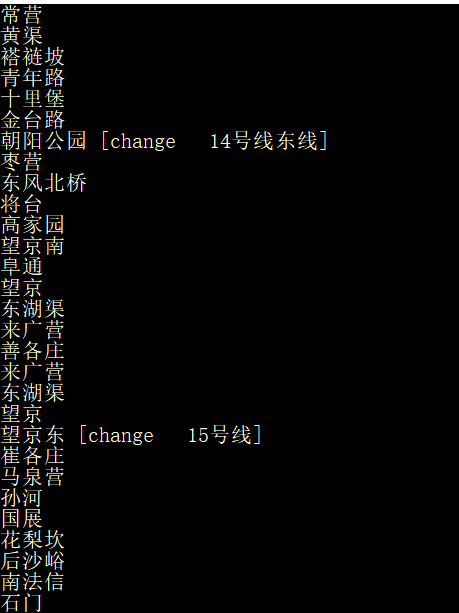

### GUI模式设计

采用前后端模式，设计如下接口，其中括号内为后端逻辑：

其中1-3为必做，4-5选做

1. 根据指定$id$，将一个地铁站的颜色设为亮绿色（表示下一站）
2. 根据指定$id$，将一个地铁站的颜色设为浅绿色（表示已途径站）
3. 根据指定$id$，将一个地铁站的颜色设为红色，或者设计一个图标（表示该站换乘）
4. 根据有序二元组($id_1$，$id_2$)，用带箭头实线将一条地铁线标记（表示从当前站到下一站的路径）
5. 根据有序二元组($id_1$，$id_2$)，用不带箭头的虚线将一条地铁线标记（表示已经走过的地方)

其中4/5中的地铁线指的是两个站点之间的一个连线。

### 后端功能增删

增加了/g模式，启动gui版本，采用前后端模式，前端负责展示，后端负责计算和指导前端显示的产生。

需要给车站节点增加属性：坐标。

为了能在GUI上展现换乘，修改了求环游路径部分的代码，使得能够在返回信息中得到换乘的信息。

至此后端整体功能完善，接下来只需要和前端进行交互展示即可。

### 优化后端逻辑

为了减小后端配置文件之间的依赖关系，**增强模块独立性**，原本需要在配置文件中声明读入地图的站点数和地铁数，现在不需要在配置文件中设置地铁站点和地铁线数，而是通过地图文件直接获取。

### 完善了环路查询功能，修改了config文件合理性

现在查询环路会告知在哪里需要换乘

### GUI接口明细：

使用pair<string, string> 携带<站点，地铁线>信息返回至图形界面。图形界面函数配合name2subwayStructs使用。

name2subwayStructs为将名字与地铁映射的map（map<string, SubwayStruct*>）
