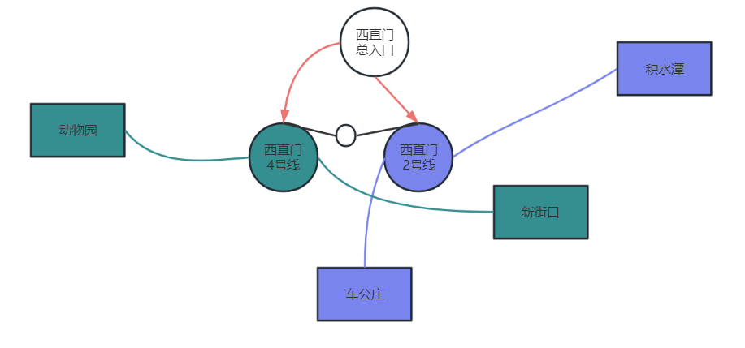
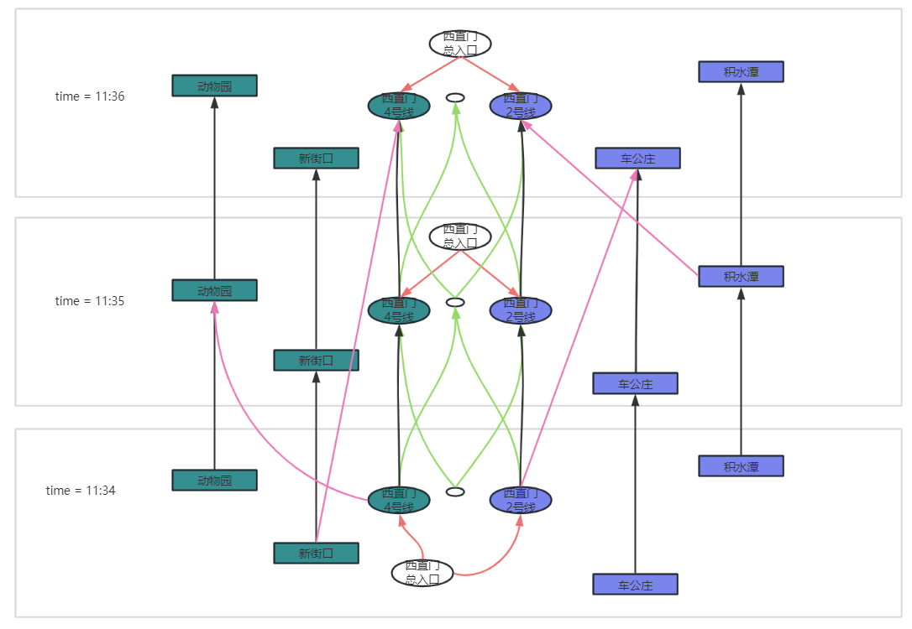
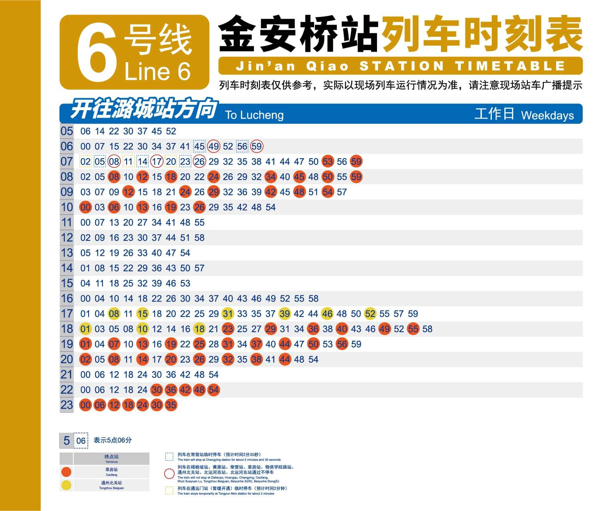
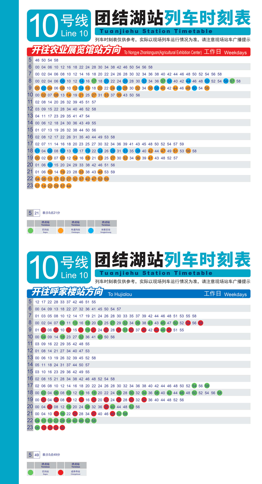
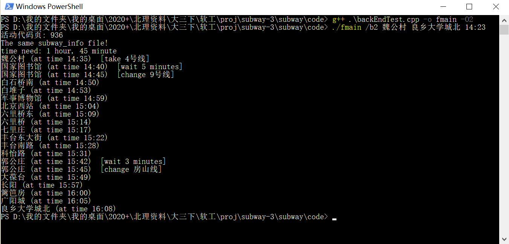
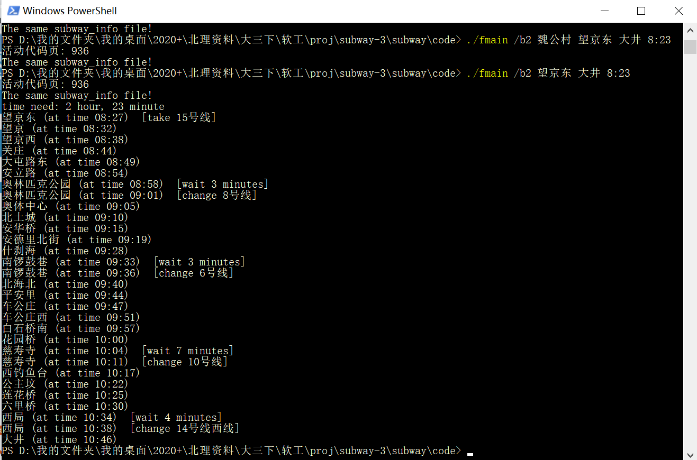
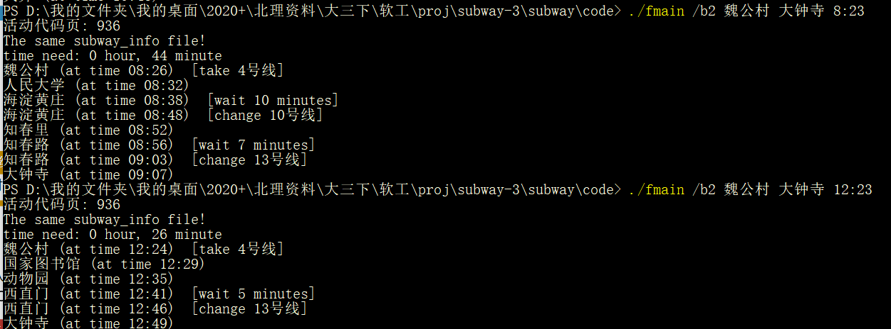

### 由于后端的week2任务不重，先推进到week3.

对于需求：

地铁线路的更新

* 开通新线路，增加换乘站
* 支持不同城市的地铁线路数据，在使用时可通过参数进行切换

已经可以不需要代码实现，只需要修改配置文件中的**地铁线路图文件路径**即可。

对于需求：

线路规划时考虑地铁线路的以下情况：

* 大站快车：只停靠部分站点
* 不同时段的起点和终点不同
* 不同时间段的发车时间间隔不同：换乘时除考虑站点数，还要考虑总用时，此时需要如何修改程序？

分析：

### 大站快车 & 不同起点终点 & 定点发车。

单独考虑大站快车其实没有意义，只需要单独在地铁线路文件中增加一条大站快车地铁线路即可。

这里将**大站快车**和**不同时段的起点和终点不同**一起考虑：

总体来说，在1，2周的需求中，我们认为地铁线路在整个运行中是恒定的。只要到站了就立刻有下一辆车可以坐。现在的模型转换为，地铁运行是根据时间进行的；地铁只有在**特定的时间点**才会发车；一天之中的地铁发车时间间隔不均等；不同时间发车的地铁停靠站点不同（中间停靠站不同，起点终点也可能不同）；

#### 算法分析

我们使用分层图来解决这个问题：

北京地铁运营时间从最早**4:54**到最晚**00:21**，共计**1168分钟**，因此我们将图分成1168层，第$i$层表示第$i$分钟，加入有一辆车从上午9:05从A站出发，9:08到达下一站B，则将从第**252**层的A站点向第**255**层的B站点连一条边，。

而对于换乘，有可能需要在站点等待，所以对于$i$层的每一个站点都需要向$i+1$层的相同站点连接一条边，表示在该站点进行了一分钟的等待。

对于总入口站点的连边不做改变，还是依旧是向着本层内所表示的站点连边。

我们假设换乘不能瞬间完成，至少需要$k$ 分钟在站内走动时间。因此在A站点下车后不能立刻从A站点上别的车。我们需要将原图中连向同一层的换乘代价边也改为从$i$层连向$i+1$层。

#### 案例介绍

下面我们对比需求一中的建图。为了使得作图更加直观，仅考虑西直门站。图一是在之前的需求中建出的图，具体建图方法可见week1的blog。这里着重讲解新的建图。

四类边：

在这个图中，**绿线**代表换乘耗时，这里假设换乘耗时为2分钟。因此建立一个辅助结点（这里辅助结点的建立原则没有做出修改，依旧是换乘耗时数-1。因此可以看到，从西直门站的2号线换乘4号线，需要经过两层图，也就是耗时2分钟。

**黑线**代表在站台等待，即若当前没有车，则需要等候。

**粉线**表示坐车，假设**11点34分**有一辆从**西直门**开往**动物园**的**四号线**列车，用时为$1$**分钟**，则建图如左下角的粉线。其他粉线按照起点从左到右的顺序依次代表：1. **11点34分**有一辆从**新街口**开往**西直门**的**四号线**列车，耗时$2$分钟；2. **11点34分**有一辆从**西直门**开往**车公庄**的**二号线**列车，耗时$2$分钟；3. **11点35分**有一辆从**积水潭**开往**西直门**的**二号线**列车，耗时$1$分钟。

**红线**表示刚到这个站点的时候可以任意选择初始的线路进行坐车，不耗时。

#### 复杂度分析

记n为站点数，m为分钟数(1168)，则空间复杂度为O($N*M$)，假设有500个站点，则约为$5*10^5$的空间复杂度，由于代价已经放在分层图中，不需要在边上计算代价（时间，越往高层的图跑代价越高），所以采用bfs即可。因此时间复杂度也为O($N*M$)。对于$5*10^5$来说，理论上是能在0.1s以内响应的，因此整体效率很高，用户体验不出迟钝。

#### 配置路线图 

在北京地铁官网上可以看到具体的地铁线路时刻表十分复杂，并且没有配置文件导出的途径，因此我们预计选择部分线路进行实验。

update: 实际采用随机生成的北京地铁线路时刻表来执行此功能
添加了北京地铁时刻表。
根据随机数生成器产生大站快车，不同起点终点，不同发车时间，不同运营间隔等一系列真实情况
生成使用generator.py实现

https://www.bjsubway.com/station/xltcx/line10/2013-08-26/192.html?sk=1

#### 代码完成
按照设计思路建图，并且添加了后端测试。
在我们随机生成的模拟时刻表下，算法表现优异。

可以发现不同时间出发的搭乘方案不一致：
由于这里的时刻表是随机生成的，因此和实际的生活中高低峰情况并不一样，但是如果有真实的时刻表是可以直接使用的。

代码主要在抽象图AbstGraph类中新增了run_v2函数，使用Graph的run_query_from_a_to_b_v2调用。函数内使用普通队列维护的bfs取代了上一版中的双端队列维护的01bfs。
为构建新图，实现了initial_v2，buildRoute_v2等带v2子串的函数，具体建图的方式见上文。在代码实现上，先通过v1也就是需求一中的建图建一次图，而后删去所有的边，但是保留点以及辅助点。在此基础上，读取配置文件subway_timetable，通过函数rebuild_v2和buildRoute_v2建立上面提到的四类边。